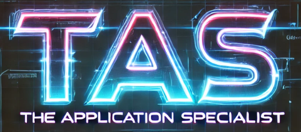

# 🛠️ Prototype Application

[](https://codecov.io/gh/nickhoess/ApplicationSpecialist)



## 🚧 Project Status: In Development 🚧

This is a **prototype application** built with **Spring Boot**. It features both a **command-line interface (CLI)** and a **REST API** that allows users to interact with the system, set user information, and generate a CV in **LaTeX format**.

> ⚠️ **Note:** This project is currently in the prototyping phase and is neither ready for production use nor fully functional yet.

---

### 💻 Usage

#### Command Line Interface
When you run the application locally, you will be presented with a simple **shell interface**. You can use the following commands:

| **Command**       | **Description**                             |
|------------------|---------------------------------------------|
| `hello`          | Print `"Hello, There!"`                      |
| `set-user`       | Set user information                        |
| `show-user`      | Show current user information               |
| `generate-cv`    | Generate a CV in LaTeX format               |
| `help`           | Show available commands                     |
| `exit`           | Exit the shell                              |

#### REST API
The application also exposes a **REST API** that can be used to generate CVs programmatically:

| **Endpoint**               | **Method** | **Description**                             |
|---------------------------|------------|---------------------------------------------|
| `/api/home/generateCV`    | POST       | Generate a CV using the provided user data  |

Example request:
```bash
curl -X POST http://localhost:8080/api/home/generateCV \
  -H "Content-Type: application/json" \
  -d '{
    "name": "John Doe",
    "email": "john.doe@example.com",
    "phone": "1234567890",
    "address": "123 Main St",
    "skills": ["Java", "Spring"],
    "workExperiences": [
      {
        "company": "Example Corp",
        "position": "Software Engineer",
        "years": "2020-2023"
      }
    ],
    "education": [
      {
        "degree": "B.Sc. Computer Science",
        "institution": "University of Example",
        "year": "2020"
      }
    ]
  }'
```

---

## 📄 CV Generation Project
This project is designed to create professional CVs/resumes with minimal effort. Using structured data input, it generates formatted CV documents through a combination of template processing and LaTeX compilation.

### ✨ Key Features
- **Automated CV Generation**: Transform user data into professionally formatted documents
- **LaTeX Templates**: Leverage LaTeX for professional-quality typesetting
- **Multiple Input Methods**: Use either CLI or REST API to generate documents
- **Customizable Sections**: Include education, work experience, skills, and projects
- **Data Persistence**: Store CV data in MongoDB for future updates

### 🔧 Technology Stack
- **Backend**: Spring Boot 3.4.x (Java 17)
- **Database**: MongoDB (containerized)
- **Build Tool**: Gradle
- **Deployment**: Docker & Docker Compose
- **Document Generation**: LaTeX template processing
- **API**: RESTful endpoints with Cross-Origin Resource Sharing (CORS) support
- **Testing**: JUnit 5
- **Architecture**: MVC+S pattern with dependency injection

### 🔄 Data Flow
1. User inputs data via CLI or REST API
2. Data is processed by service layer
3. Templates are populated with user information
4. LaTeX engine generates formatted PDF document
5. User data is stored in MongoDB for future retrievals

### 🐳 Docker Deployment
This application can be run as a containerized service using Docker and Docker Compose.

**Running with Docker Compose**
- Make sure you have Docker and Docker Compose installed
- Build and start the containers
- The application will be available at http://localhost:8080
- The MongoDB database will be available at mongodb://localhost:27017

**Docker Compose sets up:**
- A MongoDB container for data persistence
- A Spring Boot application container with the application running

---

## 🏛️ MVC + S Architecture

### 🖥️ View (User Interface)
Handles user interaction via the Command-Line Interface (CLI) and REST API.
- `PrototypeApplication`: The main class that initializes and runs the CLI

### 🎮 Controller (Application Logic)
Manages user interactions and delegates processing to the service layer.
- `HomeController`: Handles CLI commands and CV generation logic
- `HomeRestController`: Provides REST endpoints for CV generation

### 🖨️ Service (Business Logic & Processing)
Handles the core processing and business logic.
- `HomeServiceImpl`: Implements the core service for CV generation
- `LatexServiceImpl`: Processes templates and compiles LaTeX files
- `PersistenceServiceImpl`: Handles data persistence with MongoDB
- `DataServiceImpl`: Manages data processing and transformation

### 🗂️ Model (Data Layer)
Represents the application's core data structures.
- `User`: Represents a user with various attributes
- `SoftwareProject`: Represents a software project
- `WorkExperience`: Represents a work experience entry
- `Education`: Represents educational background

---

## 💻 Prerequisites
Ensure you have the following installed before running the application:
- ✅ Java 17
- ✅ Gradle
- ✅ Docker & Docker Compose
- ✅ JUnit

