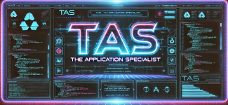

# 🛠️ Prototype Application

## 🚧 Project Status: In Development 🚧

This is a **prototype application** built with **Spring Boot**. It includes a simple **command-line interface (CLI)** that allows users to interact with the system, set user information, and generate a CV in **LaTeX format**.

> ⚠️ **Note:** This project is currently in the prototyping phase and is not ready for production use.

---

## 📁 Project Structure

### 💻 Usage
When you run the application, you will be presented with a simple **shell interface**. You can use the following commands:

| **Command**       | **Description**                             |
|------------------|-----------------------------------------|
| `hello`          | Print `"Hello, World!"`                 |
| `set-user`       | Set user information                    |
| `show-user`      | Show current user information           |
| `generate-cv`    | Generate a CV in LaTeX format          |
| `help`           | Show available commands                 |
| `exit`           | Exit the shell                          |

---

## 🏛️ MVC Architecture  

### 🖥️ **View (User Interface)**
Handles user interaction via the **Command-Line Interface (CLI)**.  

- **`PrototypeApplication`** – The main class that initializes and runs the CLI.  

### 🎮 **Controller (Application Logic)**
Manages user interactions and delegates processing to the service layer.  

- **`HomeController`** – Handles CLI commands and CV generation logic.  

### 🖨️ **Service (Business Logic & Processing)**
Handles the core processing and business logic.  

- **`LatexServiceImpl`** – Implements the LaTeX service for processing templates and compiling LaTeX files.  

### 🗂️ **Model (Data Layer)**
Represents the application's core data structures.  

- **`User`** – Represents a user with various attributes.  
- **`SoftwareProject`** – Represents a software project.  
- **`WorkExperience`** – Represents a work experience entry.  

---

### 📂 Resources  
Configuration and template files used in the application.  

- **`application.properties`** – Spring Boot application properties.  
- **`main.txt`** – LaTeX template for the CV.  
- **`template.txt`** – Another LaTeX template for the CV.  
- **`experience.txt`** – LaTeX section for experience.  
- **`projects.txt`** – LaTeX section for projects.  

---

## 💻 Prerequisites

Ensure you have the following installed before running the application:

✅ **Java 17**  
✅ **Gradle**  
✅ **JUnit**

